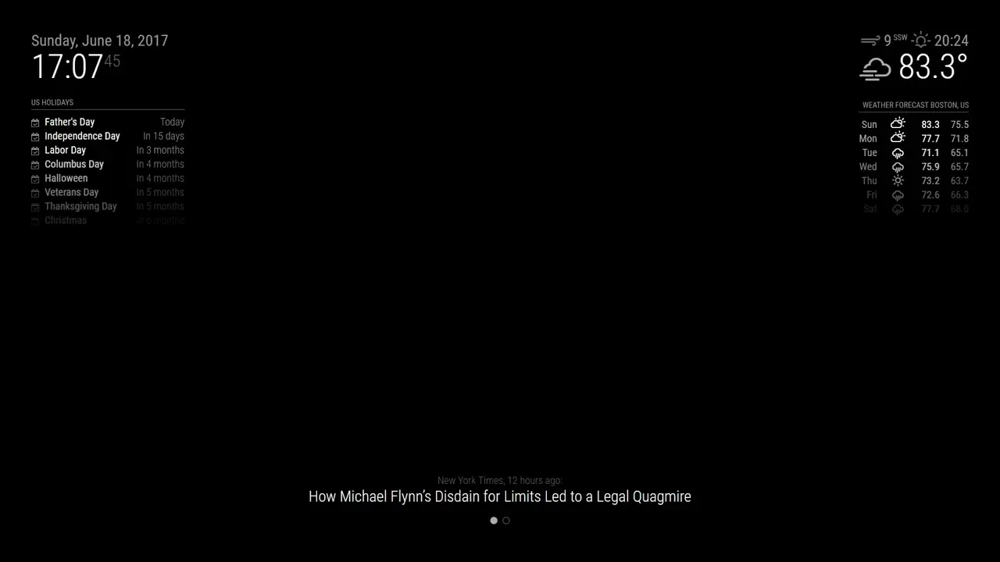

# MMM-pages

## Project status

This project is **mature** and in maintenance mode only. New features or fixes
will not be actively made. If you'd like to see a feature or fix, please
create a pull request.

This repo is **not** abandoned. I will still respond to PRs, but support
requests or bugs reports will not be monitored.

If you'd like to be a maintainer to drive new features forward, please
contribute to this repository before asking for maintainership. As this module
is used by a lot of people, I need to ensure that a new maintainer can write
high quality code and match the standards of the existing codebase.

## Description

This [MagicMirror²][mm] module allows you to have pages in your MagicMirror!
Want to have more modules in your MagicMirror, but want to keep the format?
Or, want to have grouped modules that are themed together? Look no further!



Note that this module does not provide any method of manually changing the page!
You should ask other developers to add a notification to their modules, or add
one yourself!

## Page indicator

To display what page you're on, I highly recommend checking out my [page indicator module][page indicator].

## Installation

In your terminal, go to your MagicMirror's module directory:

```bash
cd ~/MagicMirror/modules
```

Clone this repository:

```bash
git clone https://github.com/edward-shen/MMM-pages
```

## Update

Go to the module’s directory inside your MagicMirror's module directory and pull the latest version:

```bash
cd ~/MagicMirror/modules/MMM-pages
git pull
```

## Configuration

To use this module, add a configuration to the modules array in the `config/config.js` file.

There are two ways to configure this module: Using the module names or using class names. The module name based configuration is easier to use, but has the limitation that you can only use one instance of each module. So if you want to use multiple instances of the same module, you have to use the class based configuration.

*Note*: You can find complete configuration example files for both module name and class based configurations in the [example_configs](example_configs) directory.

### Module name based configuration

The easiest way to configure this module is to use the module names to define on which page they should appear:

The first element of the array is the first page, the second element is the second page, and so on.

```js
    {
        module: "MMM-pages",
        config: {
            timings: {
                default: 5000,               // rotate every 5 seconds   
                0: 20000                     // page 0 rotates every 20 seconds
            },
            modules: [
                ["newsfeed"],                // page 0
                ["calendar", "compliments"], // page 1
            ],
            fixed: [                         // modules that are always shown
                "clock",
                "weather",
                "MMM-page-indicator"
            ],
            hiddenPages: {                   // modules that are only shown on specific pages
                "screenSaver": [
                    "clock",
                    "MMM-BackgroundSlideshow"
                ],
                "admin": [
                    "MMM-SystemMonitor",
                    "MMM-OnScreenMenu"
                ]
            }
        }
    },
```

### Class based configuration

Instead of using the module name, you can also use a class name for each page. This way you can have multiple instances of the same module on different pages.

```js
    {
        module: "MMM-pages",
        config: {
            timings: {
                default: 20000,      // rotate every 20 seconds
                2: 30000             // page 2 rotates every 30 seconds
            }, 
            modules: [
                ["page0"],           // class name for page 0
                ["page1"],           // class name for page 1
                ["page2"],           // class name for page 2
            ],
            fixed: ["fixed_page"],
            hiddenPages: {
                "screenSaver": ["screensaver_page"],
                "admin": ["admin_page"],
            }
        }
    },
```

You have to add the class name to the config of the module you want to show on a specific page. You can even add more than one class name to show a module instance on multiple pages.

```js
    {   // newsfeed on page 0
        module: "newsfeed",
        classes: "page0",
        position: "...",
        config: {
            ...
        }
    },
    {   // first calendar instance on page 1
        module: "calendar",
        classes: "page1",
        position: "...",
        config: {
            ...
        }
    },
    {   // second calendar instance on page 2
        module: "calendar",
        classes: "page2",
        position: "...",
        config: {
            ...
        }
    },
    {  // this compliments instance appears on page 0 and 2
        module: "compliments",
        classes: "page0 page2",
        position: "...",
        config: {
            ...
        }
    },
    ...
```

### Configuration options

| Option              | Type                       | Default Value            | Description |
| ------------------- | -------------------------- | ------------------------ | ----------- |
| `modules`           | `[[String...]...]`         | `[]`                     | A 2D String array of what each module should be on which page. Note that all entries must take their class name (e.g. this module's class name is `MMM-pages`, while the default modules may just have `newsfeed`, without the `MMM-` prefix. |
| `fixed`             | `[String...]`              | `["MMM-page-indicator"]` | Which modules should show up all the time. |
| `excludes`          | *NA*                       | *NA*                     | **Deprecated**. Use `fixed` instead. |
| `hiddenPages`       | `{String: [String...]...}` | `{}`                     | An Object defining special `hiddenPages` which are not available on the normal page rotation and only accessible via a notification. Modules defined in `fixed` are ignored and need to be also added if you wish to have them on any hidden page. |
| `animationTime`     | `int`                      | `1000`                   | Fading animation time. Set to `0` for instant change. Value is in milliseconds (1 second = 1000 milliseconds). |
| `rotationTime`      | *NA*                       | *NA*                     | **Deprecated**. Use `timings` instead. |
| `timings`           | `object`                   | `{ default: 0 }`         | An object whose keys define the rotation time of the pages in milliseconds. <br>Example, where each page is 3 seconds, except page 3 which is 20 seconds:<br>`{ default: 3000, 2: 20000 }`<br>If a page is not defined, it will use the `default` value. <br> *Note:* Remember that the numbering starts at 0, so the first page is `0`, the second page is `1`, and so forth. |
| `rotationDelay`     | `int`                      | `10000`                  | Time, in milliseconds, of how long should a manual page change linger before returning to automatic page changing. In other words, how long should the timer wait for after you manually change a page. This does include the animation time, so you may wish to increase it by a few seconds or so to account for the animation time. |
| `rotationHomePage`  | `int`                      | `0`                      | Time, in milliseconds, before automatically returning to the home page. If a home page is not set, this returns to the leftmost page instead. |
| `rotationFirstPage` | *NA*                       | *NA*                     | **Deprecated**. Use `rotationHomePage` instead. |
| `homePage`          | `int`                      | `0`                      | Which page index is the home page. If none is set, this returns to the leftmost page instead. |
| `useLockString`     | `bool`                     | `true`                   | Whether or not to use a lock string to show or hide pages. If disabled, other modules may override when modules may be shown. *Advanced users only. Only override this if you know what you're doing.* |

For the `module` configuration option, the first element of the outer array
should consist of elements that should be on the first page. The second element
should consist of elements that should be on the second page, and so forth.

## Notifications

The following is the list of notifications that MMM-pages will handle:

| Notification | Payload type | Description |
| --- | --- | --- |
| `PAGE_CHANGED`      | `int`           | MMM-pages will switch to the provided page index. |
| `PAGE_INCREMENT`    | `int`, Optional | MMM-pages will increment the page, or by `n` times if a number is provided. Not providing a number is equivalent to sending a payload of `1`. If there are no more pages to increment by, this will loop around to the first page. |
| `PAGE_DECREMENT`    | `int`, Optional | MMM-pages will decrement the page, or by `n` times if a number is provided. Not providing a number is equivalent to sending a payload of `1`. If there are no more pages to decrement by, this will loop around to the last page. |
| `QUERY_PAGE_NUMBER` | *None*          | MMM-pages will respond with `PAGE_NUMBER_IS` with the current page index. |
| `PAUSE_ROTATION`    | *None*          | If MMM-pages is set to rotate, this will pause rotation until a `RESUME_ROTATION` notification is sent. This does nothing if rotation was already paused. |
| `RESUME_ROTATION`   | *None*          | If MMM-pages was requested to pause rotation, this will resume automatic rotation. This does nothing MMM-pages was not requested to pause. |
| `HOME_PAGE`         | *None*          | Return to the home page. If no home page is provided, return to the first page instead. |
| `SHOW_HIDDEN_PAGE`  | `String`        | MMM-pages will switch to the provided hidden page name. |
| `LEAVE_HIDDEN_PAGE` | *None*          | MMM-pages will leave the currently showing hidden page and return to the previous showing page index. |

The following is the list of notifications that MMM-pages sends out:

| Notification        | Payload type | Description                                                                                                                                                    |
| ------------------- | ------------ | -------------------------------------------------------------------------------------------------------------------------------------------------------------- |
| `MAX_PAGES_CHANGED` | `int`        | This is sent only once during initialization of MMM-pages. This contains the number of pages defined in `config.js`.                                           |
| `NEW_PAGE`          | `int`        | This notification is sent out on every page change and contains the current page index. This is to help other modules keep track of what the current page is. This is also sent out during initialization. |
| `PAGE_NUMBER_IS`    | `int`        | Sent in response to a `QUERY_PAGE_NUMBER` notification. Returns the current page index. This notification sends the same payload as `NEW_PAGE`.                |

### Notes

This module responds to the notification `PAGE_CHANGED` and the payload strictly
must be an `integer`. Note that this has strict error checking, so `"3"` will
not work, while `3` will.

This module keeps track of pages by their index rather than their page number,
so the leftmost page has an index of 0, the page to the right of that has an
index of 1, and the page to the right of that has an index of 2. Thus, to change
to the third page, your module should send out:

```js
this.sendNotification("PAGE_CHANGED", 2);
```

This module keeps internal track of how many pages you have, defined by your
config in the config file. There is no way to dynamically change the pages you
have. If there arises a need, please create an issue.

This module does not enforce how other modules represents or even responds to
MMM-pages notifications.

### Initialization

*This section provides documentation on what notifications the module sends on
startup. This section isn't necessary to read for most users.*

MMM-pages doesn't activate until we receive the `DOM_OBJECTS_CREATED`
notification, as that notification ensures all modules have been loaded. On this
notification, we send two notifications out, `MAX_PAGES_CHANGED` and `NEW_PAGE`,
so other modules that would like to keep synchronized of the starting page and
max pages have a way to determine which page to start on.

### Hidden pages

The idea behind hidden pages is to be able to create special "modes" which
are totally configurable by the user and are separated from the "normal" MM² operation.
Some examples would be a "guest", "admin" or "screensaver" mode, where only very
specific modules are shown and you do not want to have them in your normal page rotation.

These hidden pages are only accessible via notifications, so you need to send them from
other modules. Examples integrations could be with touch, bots or voice commands.
See also FAQ below.

## FAQ

- How do I interact with different pages?

  MMM-pages intentionally does not provide methods to interact with the pages.
  This is intentional by design, as there are too many ways to interact with a
  MagicMirror. [MMM-page-indicator][page indicator] does provide a way to click
  on the circles to change pages, but this requires the ability to click or tap
  on the circles itself. If no other method is available, MMM-pages provides an
  automatic rotation feature.

- Help! My module is (above/below) another module in the same region but I want
  it to be somewhere else!

  The order of your `config.js` determines your module location. If you have two
  modules, both with `position:bottom_bar`, the one that is first listed will
  appear on top. The rest will appear in the same order you defined them in. If
  you want this module to be at the very bottom, define this module as the last
  module in your `config.js` file. If you want it to be on top in that region,
  make sure no other module is defined before it that has the same region.

- Can I make a pull request?

  Please do! Feel free; I love improvements!

- I want more config options!

  Please make an issue. Thanks!

## Developer commands

If you want to contribute to this project, pleases use the following commands to maintain code quality:

- `npm install` - Install development dependencies for linting.
- `npm run lint` - Run linting checks.
- `npm run lint:fix` - Fix linting issues. Please run this before committing.

[mm]: https://github.com/MagicMirrorOrg/MagicMirror
[page indicator]: https://github.com/edward-shen/MMM-page-indicator
